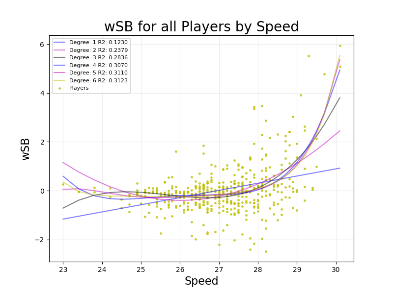
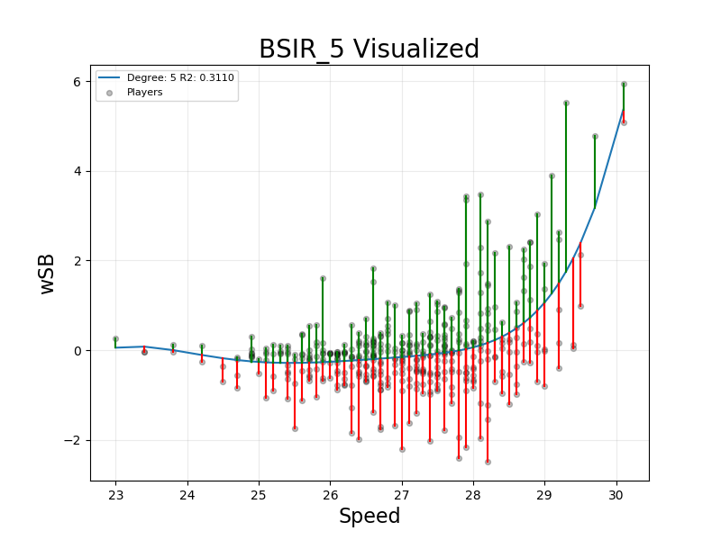
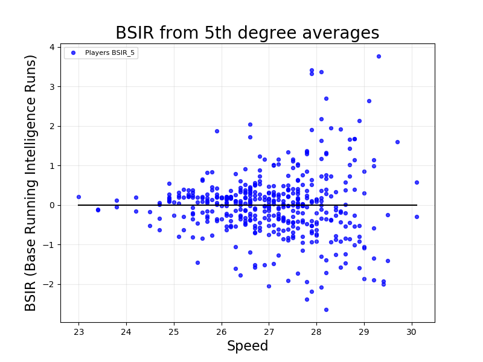
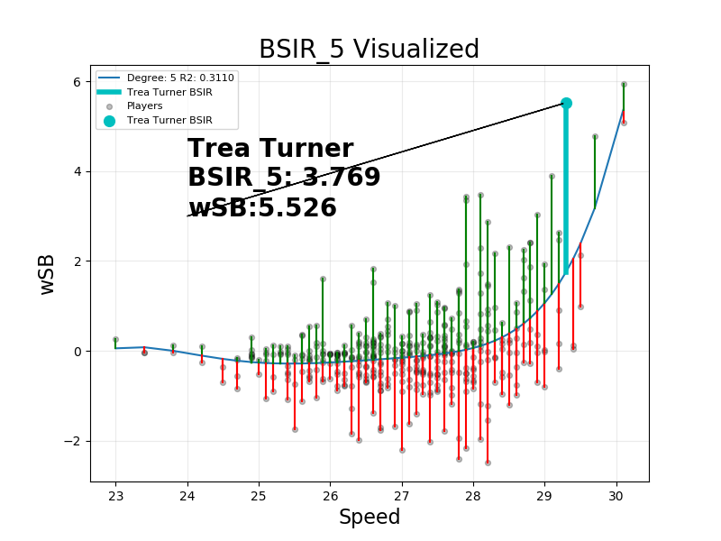
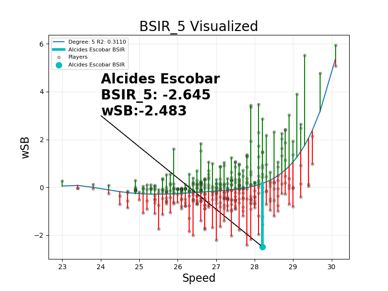

# Base Stealing Intelligence
Jake Mitchell

Sabermetrics Spring 2018

https://base-stealing-intelligence.herokuapp.com

## Aim of this project
The goal of this project was to expand on the knowledge that I have gained from taking a Sabermetrics course, and develop my own baseball statistic.  We have spend the year working with the Lahman database and Retrosheet to become familiar with many of the tools used by Sabermetricians and statisticians in general.  This is the final project for the course.  It consists of an active website where you can play around with BSIR and the data I used to create it.  There is also a video where I go through the basics of the statistic, along with some of my findings.

## Why Base Stealing Intelligence 
When I started this project I ran into a problem.  Almost every combination of existing baseball statistics has been tried, or simply makes no sense.  For example almost exery combination of the big offensive stats like hits, plate appearances, slugging, OBP and such has been tried.  So I went hunting for new statistics that I could use.  This lead me to statcast data from baseball savant https://baseballsavant.mlb.com/statcast_leaderboard.  Statcast data is relatively new set of statistics available to the public.  It was first installed into the stadiums in 2015.  One of the major things that stuck out to me was the sprint speed leaderboard.  Speed is a massive part of many sports, and I wondered if I could quantify a players ability in different areas solely based on their speed.  This lead me to find an article by Lindsey Alder from Deadspin.  Her article showed that A player’s sprint speed is highly indicative of their ability to run https://deadspin.com/sprint-speed-helps-tell-us-whos-good-at-baserunning-and-1796424570.  From here I set about developing my statistic.

Lindsey used Fan Graphs Base Running statistic BsR, which combines weighted Stolen Bases wSB, and Ultimate Base Running UBR.  Unfortunately I was unable to find enough information to create the UBR portion, so I focused on stealing bases.  

## What is Base Stealing Intelligence Runs
Since I was focused on stealing bases, I chose to base mine on wSB.  wSB is a statistic that shows how many runs above or below average player contributes to their team by attempting to steal bases.  It is calculated as follows: 

wSB = (SB * runSB) + (CS * runCS) – (lgwSB * (1B + BB + HBP – IBB))        Where lgwSB = (SB * runSB + CS * runCS) / (1B + BB + HBP – IBB) and the constants for 2017 were: runSB = 0.2 and runCS = -0.423 

When it is ploted against speed you can see a trend in the data.  This got me thinking that if we accounted for the speed portion of the statistic, we would be left with just a player's base stealing intelligence.  I fit a series of polynomials to the data, so that I could have a function that would give me an expected wSB based on a players speed.

The low correlation values of these functions don't bother me, as the noise that they don't fit is exactly what I am trying to quantify.  I found that the 5th degree polynomial gave me the best results over all of the data so I did most of my analysis using that.  When we graph that line, the distance between each player's actual wSB and their predicted wSB represents their BSIR.

Therefore BSIR is calculated as follows:

BSIR = wSB - lgwSBbySpeed(speed)
Where lgwSBbySpeed(speed) is a function that predicts wSB based on speed and league averages.

## How is BSIR useful?

## Findings
First off, I wanted to see how well my BSIR still correlated with the original wSB.  When we plot the two against each other we see that they are actually very correlated.  A score of 0.8300!

We can also plot all of the players BSIR based on their Speed:

This showed me that as a player's speed increases, the variance in their BSIR increases.  My best guess for this is that because faster players are held to a higher standard by their coaches and teammates.  This means that they are more likely to train to be great base runners.  Those who really excel get really high BSIR, while those who maybe don't train as much get very low BSIR.

I next wanted to look at the outliers in the statistic to see if they line up with conventional wisdom.  The player with the highest BSIR is Trea Turner, whom many believe to be the best base stealer in the league.  His base stealing insticts alone ccount for 3.769 runs over the course of the 2017 season

On the flip side we have Alcides Escobar.  He has recently been touted as the "Replacement Level Player", as his stats are so near to the bottom of the league.  His poor instincts account for -2.483 of his -2.645 wSB.  The ironic thing is that he is actually one of the faster players in the league.  He just doesn't know how to use it!

